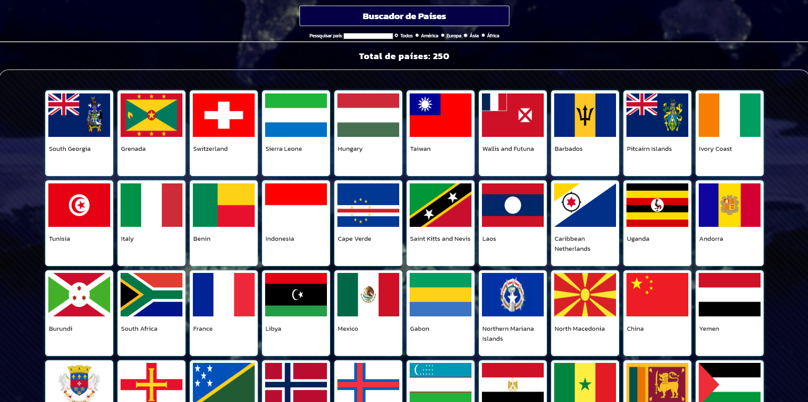
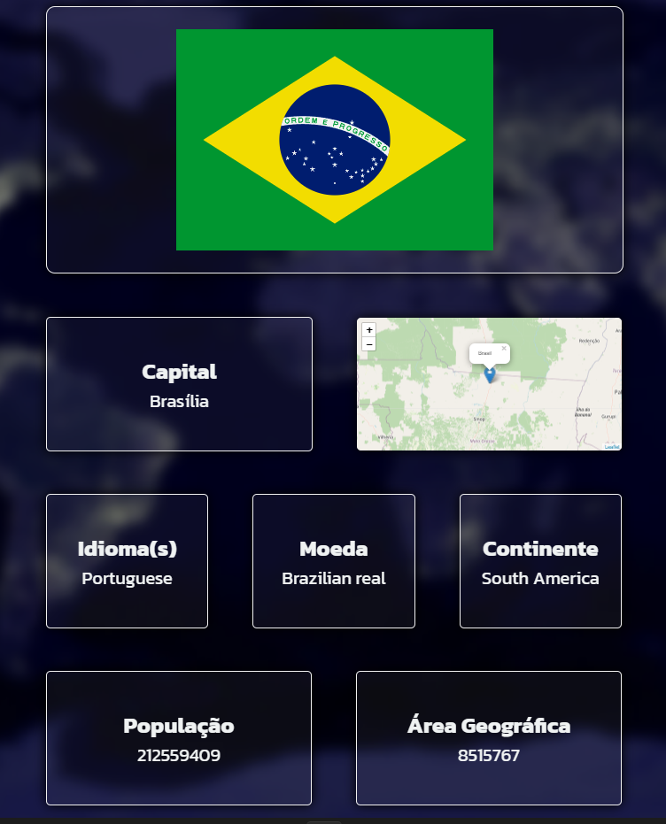
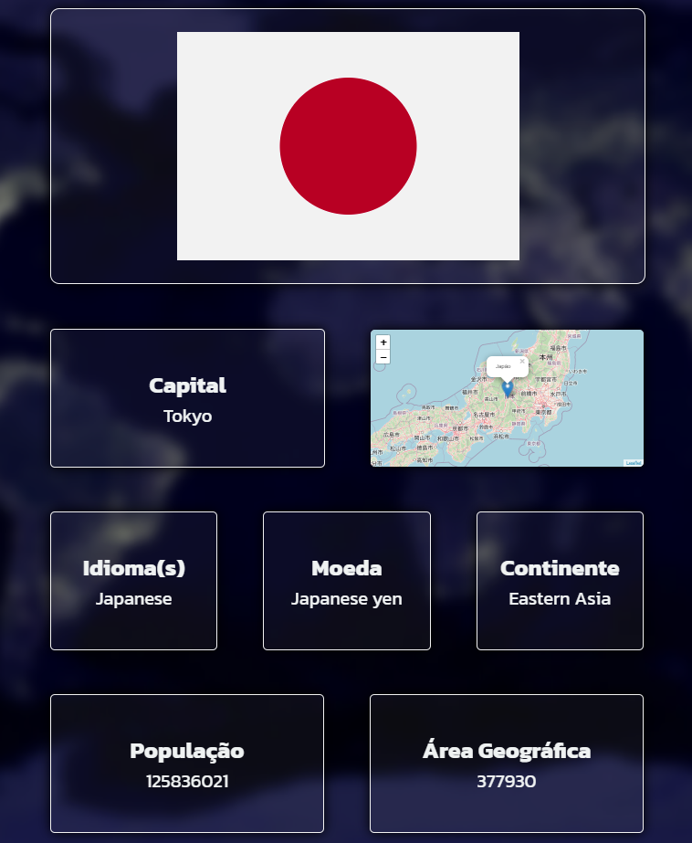

# PROJETO FINAL BUSCADOR DE PAÍSES

## Introdução
O projeto final consiste em criar um site que permita ao usuário buscar países pelo nome, além de exibir informações sobre o país pesquisado como capital, região, população, área entre outros, tudo isso utilizando a API do Rest Countries.

## Tecnologias
- HTML5
- CSS3
- JavaScript

## Página Principal


## Página de Detalhes




### Considerações Finais
O projeto foi desenvolvido com sucesso, utilizando as tecnologias solicitadas, teve alguns erros e bugs no processo, porém tudo foi resolvido e serviu de aprendizado para futuros projetos.

```
Projeto criado por @Mattheus-Abreu durante a disciplina Programação Web I, ministrada pelo professor Henrique Neto.
```